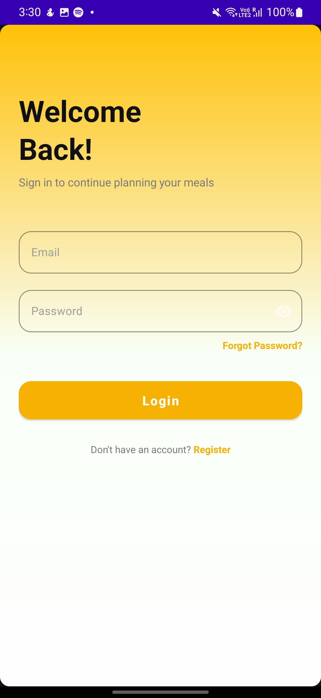
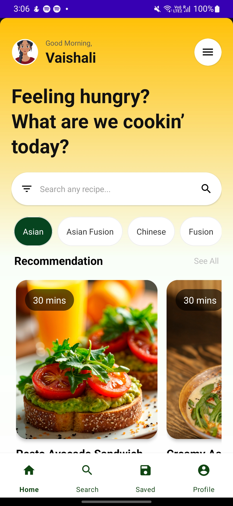
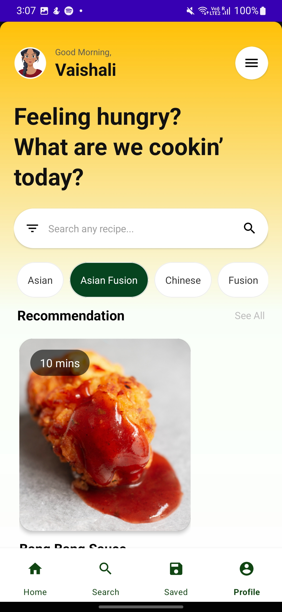
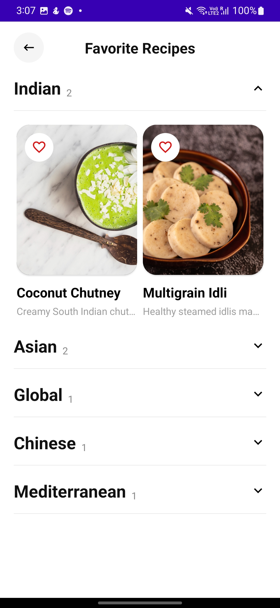
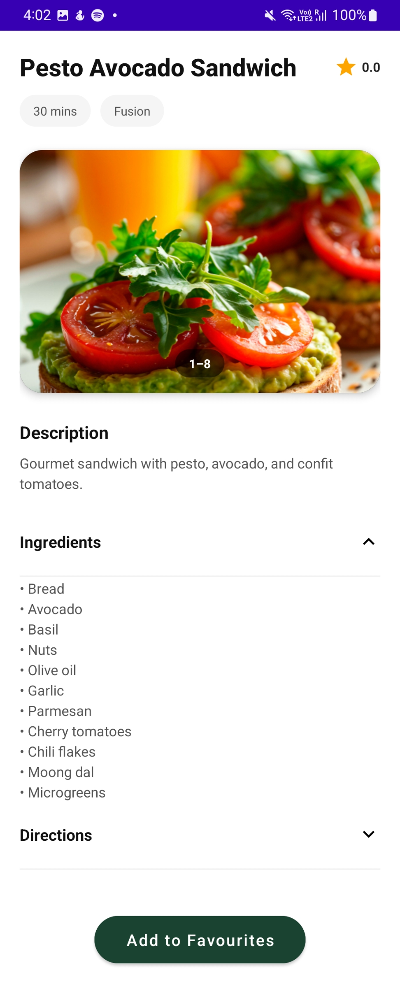
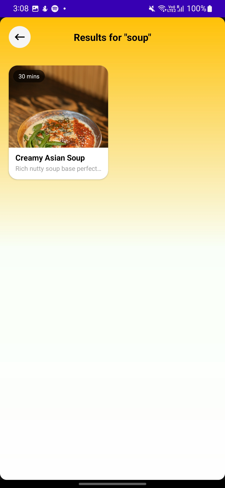
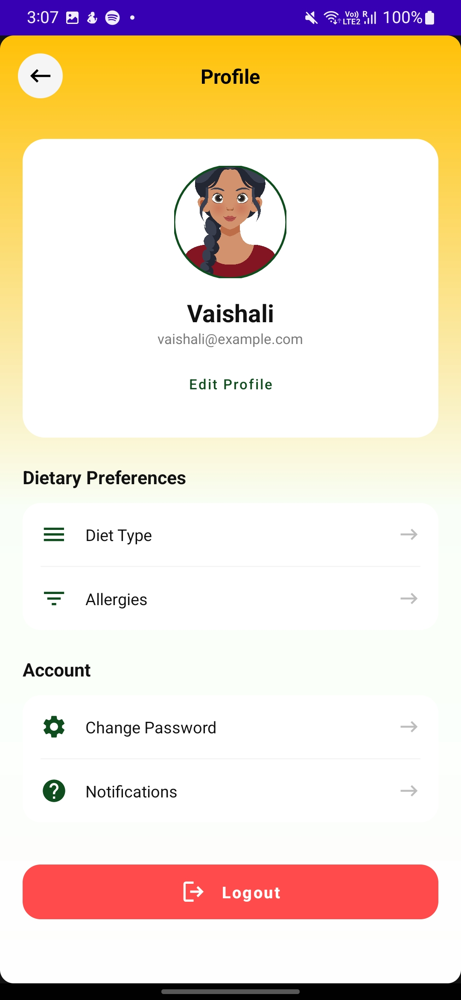
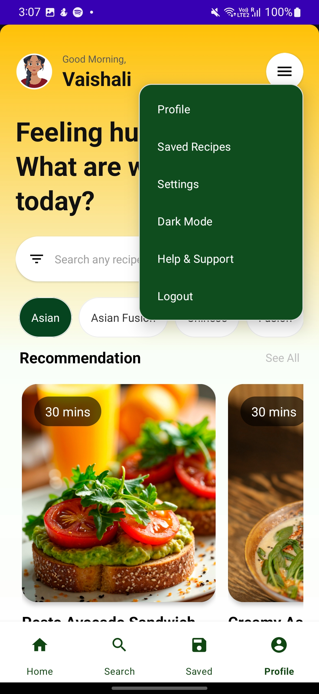

# SmartMealPlanner

SmartMealPlanner is a modern Android application designed to help users discover, search, and save their favorite recipes. The app utilizes a clean MVVM architecture and leverages powerful Jetpack libraries to provide a seamless user experience.

---

## Features

* **Recipe Discovery:** Browse **Recipes of the Week** and personalized recommendations directly on the home dashboard.
* **Dynamic Categorization:** Filter recipes by categories such as Asian, Indian, Mediterranean, etc. using an interactive horizontal selector.
* **Powerful Search:** Real-time search functionality integrated with the IME (keyboard) search action.
* **Favorites Management:** Save preferred recipes to a dedicated favorites list for offline-style access.
* **User Profiles:** Manage personal settings and secure session handling.
* **Secure Authentication:** Token-based authentication using DataStore Preferences.

---

## Tech Stack

The project is built using modern Android development practices.

### Language

* Kotlin

### Architecture

* MVVM (Model-View-ViewModel)
* Clean separation of concerns

### Networking

* Retrofit 2
* OkHttp
* REST API

### Asynchronous Work

* Kotlin Coroutines
* Non-blocking UI operations

### UI Components

* RecyclerView
* Custom Adapters
* Material Design 3
* Glide for optimized image loading

### Jetpack Libraries

* ViewModel
* LiveData
* DataStore Preferences
* Navigation Component

---

## Project Structure

```text
com.example.smartmealplanner
├── adapter
│   ├── CategoryAdapter
│   ├── RecommendationAdapter
│   └── RecipeWeekAdapter
│
├── data
│   ├── api
│   │   ├── RetrofitClient
│   │   ├── ApiService
│   │   └── TokenManager
│   │
│   └── model
│       ├── Recipe
│       ├── User
│       └── Response
│
├── ui
│   ├── activity
│   │   ├── HomeActivity
│   │   ├── RecipeActivity
│   │   └── ...
│   │
│   ├── viewmodel
│   │   ├── HomeViewModel
│   │   └── HomeViewModelFactory
│   │
│   └── common
│       ├── Interfaces
│       └── ClickListeners
│
└── utils
    └── Shared utility classes
```

---

# Getting Started

## Prerequisites

Before running the project, make sure you have the following installed:

* Android Studio Ladybug or newer
* JDK 17 or higher
* Android SDK Level 34 (UpsideDownCake)

---

## Installation

### 1. Clone the repository

```bash
git clone https://github.com/yourusername/smartmealplanner.git
```

### 2. Open the project

Open the project in Android Studio.

### 3. Configure the Backend URL

Ensure the `BASE_URL` in `RetrofitClient.kt` points to your backend API.

```kotlin
const val BASE_URL = "https://your-backend-url.com/"
```

### 4. Sync Gradle

Sync the project with Gradle Files.

### 5. Run the Application

Run the application on an emulator or physical Android device.

---

# Usage

## Home Dashboard

Upon login, users can view:

* Recipes of the Week
* Personalized recommendations
* Recipe categories
* Top recipe picks

---

## Search

Use the search bar to find recipes by keyword.

The search functionality is integrated with the IME keyboard search action.

---

## Recipe Details

Click on any recipe card to view:

* Recipe information
* Ingredients
* Cooking instructions
* Other recipe details

---

## Favorites

Save preferred recipes to a dedicated favorites list for quick access.

---

## User Profile

Manage personal settings and secure session handling.

---

## Logout

Access the popup menu from the `menuCard` on the home screen to securely log out.

---

# Architecture

SmartMealPlanner follows the **MVVM (Model-View-ViewModel)** architecture pattern.

```text
┌──────────────────────────────┐
│             UI               │
│ Activities / Fragments       │
└──────────────┬───────────────┘
               │
               ▼
┌──────────────────────────────┐
│          ViewModel           │
│       Business Logic         │
└──────────────┬───────────────┘
               │
               ▼
┌──────────────────────────────┐
│             Data             │
│ API / Models / TokenManager  │
└──────────────┬───────────────┘
               │
               ▼
┌──────────────────────────────┐
│        Node.js Backend       │
│           REST API           │
└──────────────────────────────┘
```

---

# Networking

The Android application communicates with the Node.js backend through REST APIs using Retrofit 2 and OkHttp.

```text
Android Application
        │
        │ Retrofit / OkHttp
        ▼
     REST API
        │
        ▼
  Node.js Backend
        │
        ▼
    Database
```

---

# Authentication

SmartMealPlanner uses token-based authentication.

Authentication tokens are stored locally using **Jetpack DataStore Preferences**.

```text
User Login
    │
    ▼
Node.js Backend
    │
    ▼
Authentication Token
    │
    ▼
DataStore Preferences
    │
    ▼
Authenticated API Requests
```
---

A modern recipe discovery and meal-planning Android application built with **Kotlin, MVVM, and Jetpack libraries**.

---

## 📱 Screenshots

### Login Screen



### Home Screen



### Category Home



### Favorite Page



### Recipe Details Page



### Search Result



### Settings Page



### Menu Option



---